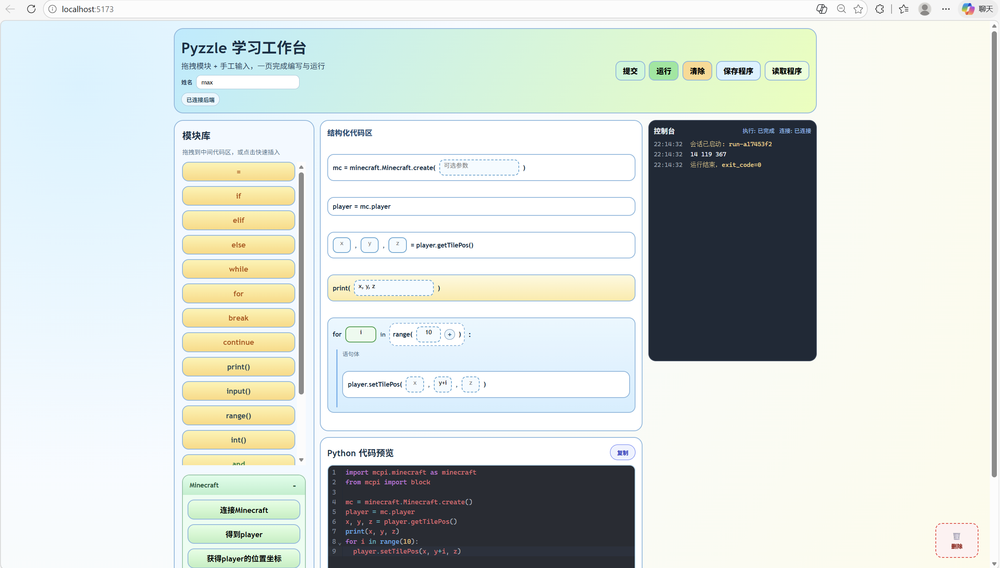
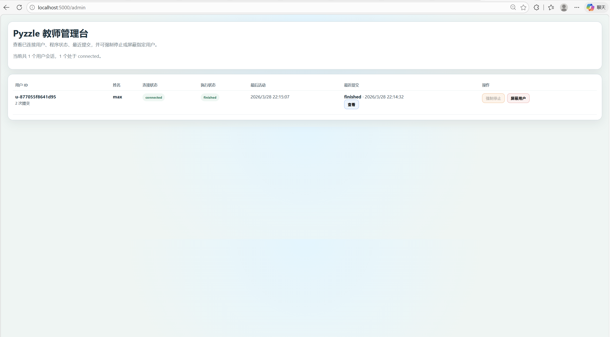

# Pyzzle

Pyzzle is a block-based + text-based Python learning workspace for classroom use.
Pyzzle 是一个面向课堂教学的 Python 学习工作台，支持“代码块 + 文本代码”混合编程。

- Student side: build code with blocks, edit Python directly, submit or run code, and view console output.
- Teacher side: monitor sessions, view latest submissions, inspect code, force stop runs, and block/unblock users.


## 1. Project Structure / 项目结构

```text
pyzzle/
  backend/    Flask + Socket.IO backend, sandbox runner, teacher dashboard
  frontend/   Vue 3 + TypeScript + Vite student workspace
```

## 2. Key Features / 核心功能

### English
- Real-time run control via WebSocket (start/stop/input/heartbeat).
- Dual state tracking:
  - Connection state: connected, reconnecting, terminated, blocked.
  - Execution state: idle, running, waiting_input, finished, failed, interrupted.
- Per-user sessions identified by user_id cookie.
- Optional user name input on frontend; teacher panel can display user_id + name.
- Student actions:
  - Submit code without running.
  - Run code in sandbox subprocess.
  - Save/Load block programs as .pyz files.
- Teacher actions:
  - View latest submission (modal code viewer with copy button).
  - Force stop running code.
  - Block/unblock user.

### 中文
- 基于 WebSocket 的实时运行控制（运行/停止/输入/心跳）。
- 双状态机：
  - 连接状态：connected、reconnecting、terminated、blocked。
  - 执行状态：idle、running、waiting_input、finished、failed、interrupted。
- 会话按 user_id（cookie）隔离。
- 前端可选填写姓名，教师端可同时看到 user_id 与姓名。
- 学生端支持：
  - 仅提交代码（不运行）。
  - 沙箱运行代码并查看输出。
  - 以 .pyz 文件保存/读取代码块程序。
- 教师端支持：
  - 查看最新提交代码（弹窗 + 一键复制）。
  - 强制停止运行。
  - 屏蔽/解除屏蔽用户。

## 2.1 Teacher Dashboard / 教师端仪表板

### English
The teacher dashboard provides real-time monitoring and control of all student sessions.

**Access the teacher dashboard:**
- Navigate to `http://<host-ip>:5000/admin` in your browser
- No login required (for classroom/intranet use)

**Teacher dashboard features:**
1. **Active Sessions List** – View all connected students with:
   - Student user_id and optional name
   - Current connection and execution status
   - Last submission timestamp
2. **View Submission** – Click on any student to view their latest code submission
   - Full code editor with syntax highlighting (read-only)
   - One-click copy button to copy code to clipboard
3. **Force Stop** – Immediately terminate a student's running code
   - Useful for stopping infinite loops or stuck processes
4. **Block/Unblock User** – Temporarily block or restore a student's access
   - Blocked users see "已屏蔽" (blocked) in connection status
   - Click to toggle block status

**Screenshot:** See `screenshot-teacher.png` for visual reference.

### 中文
教师端仪表板提供所有学生会话的实时监控和控制。

**访问教师端：**
- 在浏览器中打开 `http://<主机IP>:5000/admin`
- 无需登录（仅供课堂/内网使用）

**教师端功能：**
1. **活跃会话列表** – 查看所有已连接的学生，包括：
   - 学生的 user_id 和可选的姓名
   - 当前连接状态和执行状态
   - 最近一次提交的时间戳
2. **查看提交代码** – 点击任何学生查看其最新的代码提交
   - 全功能代码编辑器（有语法高亮，只读）
   - 一键复制按钮，方便复制代码到剪贴板
3. **强制停止** – 立即终止学生正在运行的代码
   - 用于停止死循环或卡住的进程
4. **屏蔽/解除屏蔽用户** – 临时禁用或恢复学生的访问权限
   - 被屏蔽的学生会看到"已屏蔽"的连接状态
   - 点击按钮切换屏蔽状态

**参考截图：** 见 `screenshot-teacher.png`。

## 3. Requirements / 环境要求

### English
- Python 3.10+ (recommended 3.11)
- Node.js 18+ and npm
- Windows/macOS/Linux

### 中文
- Python 3.10 及以上（推荐 3.11）
- Node.js 18 及以上 + npm
- 支持 Windows/macOS/Linux

## 4. Backend Setup / 后端启动

### English
1. Go to backend directory.
2. Install dependencies.
3. Start server.

```bash
cd backend
pip install -r requirements.txt
python src/app.py
```

Backend listens on `0.0.0.0:5000`.

- Health check: `http://<host-ip>:5000/health`
- Teacher dashboard: `http://<host-ip>:5000/admin`

### 中文
1. 进入 backend 目录。
2. 安装依赖。
3. 启动服务。

```bash
cd backend
pip install -r requirements.txt
python src/app.py
```

后端默认监听 `0.0.0.0:5000`。

- 健康检查：`http://<主机IP>:5000/health`
- 教师端：`http://<主机IP>:5000/admin`

## 5. Frontend Setup / 前端启动

### English
```bash
cd frontend
npm install
npm run dev
```

Vite is configured to listen on all interfaces (`0.0.0.0`), so LAN devices can access it.

Default frontend URL: `http://<host-ip>:5173`

By default, frontend backend base URL is `http://127.0.0.1:5000`.
For LAN use, set environment variable `VITE_BACKEND_URL` to your backend host IP.

Example `.env` in `frontend/`:

```env
VITE_BACKEND_URL=http://192.168.1.23:5000
```

**Feature flags** (optional configuration):

The student workspace supports runtime feature configuration via environment variables:

- `VITE_ENABLE_TURTLE` (default: `true`) – Show/hide turtle blocks in the palette and generated code imports
- `VITE_ENABLE_REMOTE_EXECUTION` (default: `true`) – Show/hide run button, stop button, and console output panel

Example `.env` to disable turtle and remote execution:

```env
VITE_BACKEND_URL=http://192.168.1.23:5000
VITE_ENABLE_TURTLE=false
VITE_ENABLE_REMOTE_EXECUTION=false
```

### 中文
```bash
cd frontend
npm install
npm run dev
```

Vite 已配置监听 `0.0.0.0`，局域网设备可访问。

前端默认地址：`http://<主机IP>:5173`

前端默认后端地址是 `http://127.0.0.1:5000`。
局域网部署时请在前端设置 `VITE_BACKEND_URL` 为后端主机 IP。

在 `frontend/` 下创建 `.env` 示例：

```env
VITE_BACKEND_URL=http://192.168.1.23:5000
```

**功能开关**（可选配置）：

学生工作台支持通过环境变量运行时配置功能：

- `VITE_ENABLE_TURTLE`（默认：`true`） – 显示/隐藏调色板中的 turtle 块和生成的代码导入
- `VITE_ENABLE_REMOTE_EXECUTION`（默认：`true`） – 显示/隐藏运行按钮、停止按钮和控制台输出面板

示例 `.env`，用于禁用 turtle 和远程执行：

```env
VITE_BACKEND_URL=http://192.168.1.23:5000
VITE_ENABLE_TURTLE=false
VITE_ENABLE_REMOTE_EXECUTION=false
```

## 6. Production-ish Build / 构建与预览

### English
Frontend build:

```bash
cd frontend
npm run build
npm run preview
```

### 中文
前端构建与预览：

```bash
cd frontend
npm run build
npm run preview
```

## 7. Classroom LAN Deployment Tips / 局域网课堂部署建议

### English
- Make sure backend port 5000 is allowed in firewall.
- Make sure frontend port 5173 (dev) or preview port is allowed.
- Students should open frontend URL by host IP, not localhost.
- Keep backend and frontend in same reachable network segment.

### 中文
- 放行防火墙端口：后端 5000，前端 5173（或 preview 端口）。
- 学生必须通过主机 IP 访问，不要使用 localhost。
- 确保前后端和学生设备在同一可达网段。

## 8. Current Limitations / 当前限制

### English
- Runtime sandbox is MVP-level subprocess isolation, not hardened container security.
- Session data is in-memory; restart clears runtime sessions/history.
- Teacher dashboard currently has no authentication.

### 中文
- 沙箱为 MVP 级子进程隔离，不是容器级强隔离。
- 会话数据在内存中，服务重启后会丢失运行态与历史。
- 教师端目前未做鉴权。

## 9. Troubleshooting / 常见问题

### English
- Frontend connects but cannot run:
  - Verify `VITE_BACKEND_URL` points to reachable backend IP.
  - Verify backend is running and `/health` returns ok.
- Teacher cannot see latest user updates:
  - Confirm user uses same backend instance.
  - Check browser console and backend logs.
- Student blocked but still wants to submit:
  - Current design allows submit while blocked, but run is not allowed.

### 中文
- 前端能打开但无法运行：
  - 检查 `VITE_BACKEND_URL` 是否指向可达后端 IP。
  - 检查后端是否运行，`/health` 是否正常。
- 教师端看不到最新状态：
  - 确认学生与教师连接的是同一后端实例。
  - 查看浏览器控制台与后端日志。
- 学生被屏蔽后仍需交代码：
  - 当前设计允许“提交”，但禁止“运行”。

## 10. License / 许可

Copyright (c) 2026 Max Mu

Permission is hereby granted, free of charge, to any person obtaining a copy of this software and associated documentation files (the "Software"), to deal in the Software without restriction, including without limitation the rights to use, copy, modify, merge, publish, distribute, sublicense, and/or sell copies of the Software, and to permit persons to whom the Software is furnished to do so, subject to the following conditions:

The above copyright notice and this permission notice shall be included in all copies or substantial portions of the Software.

THE SOFTWARE IS PROVIDED "AS IS", WITHOUT WARRANTY OF ANY KIND, EXPRESS OR IMPLIED, INCLUDING BUT NOT LIMITED TO THE WARRANTIES OF MERCHANTABILITY, FITNESS FOR A PARTICULAR PURPOSE AND NONINFRINGEMENT. IN NO EVENT SHALL THE AUTHORS OR COPYRIGHT HOLDERS BE LIABLE FOR ANY CLAIM, DAMAGES OR OTHER LIABILITY, WHETHER IN AN ACTION OF CONTRACT, TORT OR OTHERWISE, ARISING FROM, OUT OF OR IN CONNECTION WITH THE SOFTWARE OR THE USE OR OTHER DEALINGS IN THE SOFTWARE.